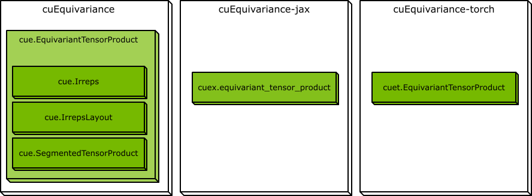

.. SPDX-FileCopyrightText: Copyright (c) 2024 NVIDIA CORPORATION & AFFILIATES. All rights reserved.
   SPDX-License-Identifier: Apache-2.0

   Licensed under the Apache License, Version 2.0 (the "License");
   you may not use this file except in compliance with the License.
   You may obtain a copy of the License at

   http://www.apache.org/licenses/LICENSE-2.0

   Unless required by applicable law or agreed to in writing, software
   distributed under the License is distributed on an "AS IS" BASIS,
   WITHOUT WARRANTIES OR CONDITIONS OF ANY KIND, either express or implied.
   See the License for the specific language governing permissions and
   limitations under the License.

NVIDIA cuEquivariance Documentation
===================================

cuEquivariance is a Python library designed to facilitate the construction of high-performance equivariant neural networks using segmented tensor products. cuEquivariance provides a comprehensive API for describing segmented tensor products and optimized CUDA kernels for their execution. Additionally, cuEquivariance offers bindings for both PyTorch and JAX, ensuring broad compatibility and ease of integration.

Equivariance is the mathematical formalization of the concept of "respecting symmetries." Robust physical models exhibit equivariance with respect to rotations and translations in three-dimensional space. Artificial intelligence models that incorporate equivariance are often more data-efficient.

An introduction to group representations can be found in the page :doc:`tutorials/irreps`.

Open Source
-----------

cuEquivariance frontend is open-source and available on `GitHub <https://github.com/NVIDIA/cuEquivariance>`_ under the Apache 2.0 license.

Installation
------------

The easiest way to install cuEquivariance is from `PyPi <https://pypi.org/>`_ using `pip <https://pip.pypa.io/en/stable/>`_.

.. code-block:: bash

   # Choose the frontend you want to use
   pip install cuequivariance-jax
   pip install cuequivariance-torch
   pip install cuequivariance  # Installs only the core non-ML components

   # CUDA kernels for different CUDA versions
   pip install cuequivariance-ops-torch-cu11
   pip install cuequivariance-ops-torch-cu12

Supported platforms
-------------------

``cuequivariance-ops-torch-*`` packages are only available for Linux x86_64.

Organization
------------

cuEquivariance is split into three packages:

.. jupyter-execute::

   import cuequivariance as cue
   # All the non-ML components

   import cuequivariance_jax as cuex
   # For the JAX implementations

   import cuequivariance_torch as cuet
   # For the PyTorch implementations

Most tensor products are defined using the :class:`cue.EquivariantTensorProduct <cuequivariance.EquivariantTensorProduct>` class, which encapsulates the :class:`cue.Irreps <cuequivariance.Irreps>` and :class:`cue.IrrepsLayout <cuequivariance.IrrepsLayout>` for each input and the output. It also includes one or more instances of :class:`cue.SegmentedTensorProduct <cuequivariance.SegmentedTensorProduct>`, which define the tensor product operations.
This descriptor is then used to create a :class:`cuet.EquivariantTensorProduct <cuequivariance_torch.EquivariantTensorProduct>` module, which can be used in PyTorch models. Or used to execute the tensor product operations using :class:`cuex.equivariant_tensor_product <cuequivariance_jax.equivariant_tensor_product>` in JAX.

Tutorials
---------

| :doc:`tutorials/irreps`
| :doc:`tutorials/layout`
| :doc:`tutorials/etp`
| :doc:`tutorials/stp`

.. toctree::
   :hidden:

   tutorials/index

API Reference
-------------

.. toctree::
   :maxdepth: 1

   api/cuequivariance
   api/cuequivariance_jax
   api/cuequivariance_torch

What's New
----------

.. toctree::
   :maxdepth: 2

   changelog
